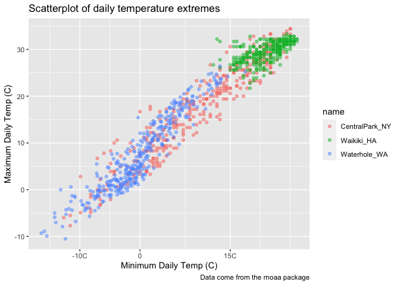

Visualization and EDA
================
Rae Spriggs
2022-09-29

``` r
library(tidyverse)
library(ggridges)
```

## Let’s import data

``` r
weather_df = 
  rnoaa::meteo_pull_monitors(
    c("USW00094728", "USC00519397", "USS0023B17S"),
    var = c("PRCP", "TMIN", "TMAX"), 
    date_min = "2017-01-01",
    date_max = "2017-12-31") %>%
  mutate(
    name = recode(
      id, 
      USW00094728 = "CentralPark_NY", 
      USC00519397 = "Waikiki_HA",
      USS0023B17S = "Waterhole_WA"),
    tmin = tmin / 10,
    tmax = tmax / 10) %>%
  select(name, id, everything())
```

    ## Registered S3 method overwritten by 'hoardr':
    ##   method           from
    ##   print.cache_info httr

    ## using cached file: ~/Library/Caches/R/noaa_ghcnd/USW00094728.dly

    ## date created (size, mb): 2022-09-29 10:33:53 (8.401)

    ## file min/max dates: 1869-01-01 / 2022-09-30

    ## using cached file: ~/Library/Caches/R/noaa_ghcnd/USC00519397.dly

    ## date created (size, mb): 2022-09-29 10:33:57 (1.699)

    ## file min/max dates: 1965-01-01 / 2020-03-31

    ## using cached file: ~/Library/Caches/R/noaa_ghcnd/USS0023B17S.dly

    ## date created (size, mb): 2022-09-29 10:33:59 (0.95)

    ## file min/max dates: 1999-09-01 / 2022-09-30

## Let’s make a scatterplot, but better

``` r
weather_df %>% 
ggplot(aes(x = tmin, y = tmax, color = name)) + 
  geom_point(alpha = 0.5) +
  labs(
    x = "Minimum Daily Temp (C)",
    y = "Maximum Daily Temp (C)",
    title = "Scatterplot of daily temperature extremes", 
    caption = "Data come from the rnoaa package"
  ) + scale_x_continuous(
    breaks = c(-10, 0, 15), 
    labels = c("-10C", "0", "15C")) 
```

    ## Warning: Removed 15 rows containing missing values (geom_point).

<!-- -->

## Make a new plot

``` r
weather_df %>% 
ggplot(aes(x = tmin, y = tmax, color = name)) + 
  geom_point(alpha = 0.5) +
  labs(
    x = "Minimum Daily Temp (C)",
    y = "Maximum Daily Temp (C)",
    title = "Scatterplot of daily temperature extremes", 
    caption = "Data come from the rnoaa package"
    ) +
  viridis::scale_color_viridis(
    name = "Location", 
    discrete = TRUE)
```

    ## Warning: Removed 15 rows containing missing values (geom_point).

<!-- -->
